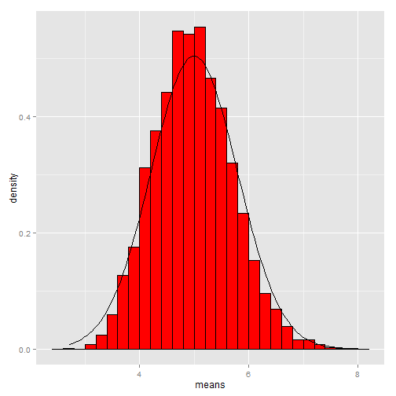

Data Products Project
========================================================
author: Moses Oduma
date: 22Nov2015

Investigating Exponential Distribution
========================================================
This app investigates the exponential distribution in R and compares it with the Central Limit Theorem using using different number simulations and different number of observations.

- Exponential distribution can be computed in R by rexp(n, lambda)
- n is the number of observations
- lambda is a rate value which is equivalent to mean
- lambda is also equal to the standard deviation
- The app compares the theoretical mean and the sample mean
- The app also compares the expected standard deviation with the theoretical standard deviation

Code
========================================================
The following default values were set
- Seed=1000, lambda=0.2, number of simulation=5000, number of observations(n)=50

```r
library(ggplot2);set.seed(1000);lambda = 0.2;n = 50;sim=5000;means = NULL
for(i in 1:sim) means = c(means,mean(rexp(n,lambda)));
samplemean<-mean(means);theoreticalmean<-1/lambda;
expectedsd<-sd(means);theoreticalsd<-(1/lambda)/sqrt(n);df<-data.frame(means);
ggplot(data = df, aes(means)) + geom_histogram(aes(y=..density..), fill = I('#ff0000'),binwidth = 0.20, color = I('black')) + stat_function(fun = dnorm, arg = list(mean = 5, sd = 0.7905694))
```

 

Plot
========================================================

 

Observations
========================================================
- As the number of observations and number of simulations increases, the exponential distribution is normally distributed
- The sample mean tends to equal to the theoretical mean as the number of simulations and observations are increased
- - The expected standard deviation tends to equal to the theoretical standard deviation as the number of simulations and observations are increased
